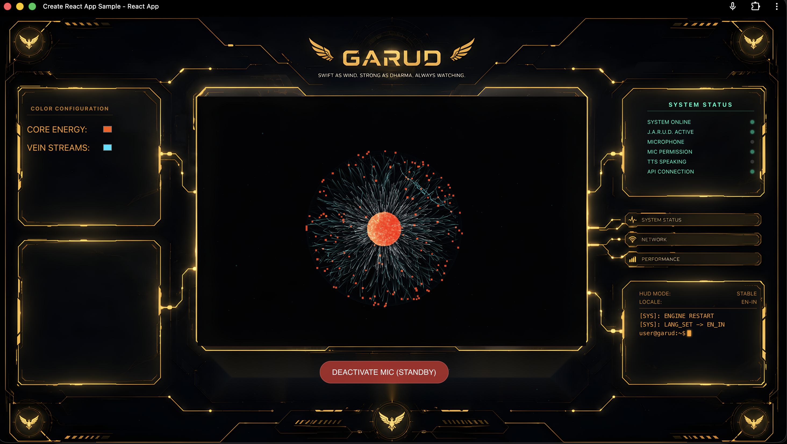

<div align="center">
  
  
  <br />
  <br />

  # 🦅 **G.A.R.U.D.** 🦅
  ### **Swift as Wind. Strong as Dharma. Always Watching.**

  <p align="center">
    <a href="https://github.com/yourusername/G.A.R.U.D/stargazers"></a>
    <a href="https://github.com/yourusername/G.A.R.U.D/network/members"></a>
    <a href="https://github.com/yourusername/G.A.R.U.D/issues"></a>
    
    
    
  </p>
</div>

---

## ⚡ **WHAT IS G.A.R.U.D.?**
**G.A.R.U.D.** is a next-generation, voice-activated AI Desktop Assistant featuring a stunning sci-fi HUD interface (inspired by J.A.R.V.I.S.). It combines real-time voice interaction, OS-level automation, computer vision, and live web search into one seamless, futuristic experience. 

---

## 🌟 **CORE FEATURES OF G.A.R.U.D.**

*   **🗣️ Conversational AI (Hinglish/Hindi/English)**: Powered by cutting-edge LLMs via Groq (`llama-3.1-70b-versatile` / `qwen3.8-27b`) for lightning-fast, natural conversations.
*   **💻 OS Automation**: Control your Mac completely hands-free. Open apps, close apps, control brightness, volume, Wi-Fi, and type text anywhere.
*   **👁️ Computer Vision**: Ask **GARUD** to "click the capture button" or "read this screen" and it will use Gemini 1.5 Flash to understand your screen and interact with UI elements automatically.
*   **🔍 Real-Time Web Search**: Need the latest news or weather? **GARUD** dynamically searches the internet (via DuckDuckGo) and reads the live results to you.
*   **🌐 WhatsApp & Telegram Integration**: Say "Chat with Papa" and **GARUD** will automatically open the app, find the contact, and prepare the chat.
*   **🎵 Apple Music & Chrome Integration**: Search and play songs natively.
*   **🎙️ Immersive Voice TTS**: High-quality text-to-speech feedback (powered by Edge TTS).

---

## 🛠️ **G.A.R.U.D. TECH STACK**

*   **Frontend**: React.js, CSS3 (Custom Sci-Fi HUD Animations)
*   **Backend**: Python, Flask, PyAutoGUI
*   **AI Engine**: Groq API (Intent Parsing & Conversation), Gemini API (Vision), Edge TTS

---

## 🚀 **BOOTING UP G.A.R.U.D.**

### 📌 Prerequisites
*   macOS (for native app integrations and AppleScript support)
*   Node.js & npm
*   Python 3.x
*   API Keys: [Groq API Key](https://console.groq.com/keys) & [Google Gemini API Key](https://aistudio.google.com/app/apikey)

### ⚙️ Installation

1.  **Clone the Repository**
    ```bash
    git clone https://github.com/yourusername/G.A.R.U.D.git
    cd G.A.R.U.D
    ```

2.  **Setup Backend**
    ```bash
    cd backend
    pip3 install -r requirements.txt
    ```
    *Note: Make sure to update your `GEMINI_API_KEY` in `server.py`.*

3.  **Setup Frontend**
    ```bash
    cd ../frontend
    npm install
    ```
    *Note: Update your Groq API Key in `blob.js`.*

### ⚡ Running G.A.R.U.D.

To launch both the Python backend and React frontend simultaneously, use the npm script:
```bash
cd frontend
npm start
```

---

## ⚠️ **IMPORTANT PERMISSIONS FOR G.A.R.U.D.**
*   **Accessibility Permissions**: Because **GARUD** uses `pyautogui` and AppleScript to automate your Mac, you must grant **Accessibility** and **Screen Recording** permissions to your Terminal/IDE in `System Settings > Privacy & Security`.
*   **PyAutoGUI Failsafe**: Move your mouse to any corner of the screen to instantly stop any automated mouse movements.

---
<div align="center">
  <h3><i>"Main Garud hu, jise Atharv ne banaya hai."</i></h3>
</div>
